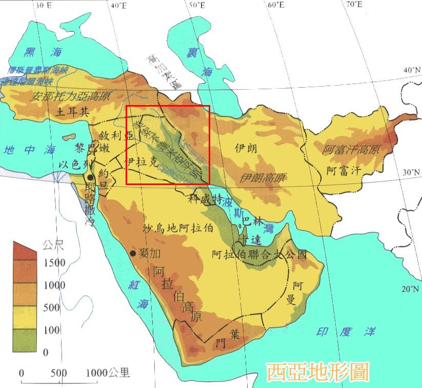

# 观念的诞生

所有的创新都是站在前人的肩膀上完成的。历史学家穿越历史的长河，去寻找各种创意或趋势的源头，以及发明创造的真正创始人。现在，我们都知道，中国人在1041年就改进了活字印刷术，这远远早于约翰·古滕贝格（Johannes Gutenberg）；对于欧洲的大航海时代来说，印度、菲律宾、爪哇和阿拉伯的造船技术与航海知识至关重要；南美洲的盖楚阿印第安人比查尔斯·古德伊尔（Charles Goodyear）早两个世纪硫化橡胶。在《遗失的真相：寻根现代科学——从古巴比伦到玛雅》中，作者迪克·特雷西（Dick Teresi）按时间顺序记录了以上种种和其他一些发明。 毫无疑问，很多发明、改进、多民族融合和文明留存的中心都存在了许多年。虽然接下来的例子不能囊括所有，但是它们都是发明创造不断进步的路途中值得一看的风景。

毫无疑问，很多发明、改进、多民族融合和文明留存的中心都存在了许多年。虽然接下来的例子不能囊括所有，但是它们都是发明创造不断进步的路途中值得一看的风景。

**苏美尔 公元前3500年——1775年** 

大约在公元前3500年，底格里斯河与幼发拉底河谷（即美索不达米亚平原）文明创造出了一种字体与陶制车轮。在那里，人们用羊毛和亚麻制衣，开凿运河，观测天体运行，并且发明了重量与尺寸度量衡。在数学方面，他们的创新包括二次方程等式与乘法。被阿卡德人征服后，各民族融合，形成了古巴比伦王国，国王汉谟拉比下令编写法典，并以自己的名字为其命名。

**中世纪的伊斯兰教 公元750——1200年** 

哲学、地质学、工程学、水力学和航海技术，穆斯林学者保存了古希腊、罗马和印度文明成果，并以此为基础进一步发展，成为了包括几何、代数和三角学的数学方面以及天文学方面的先驱。他们应用了日历和大量时间记录手段，包括日晷、象限、星盘（古希腊人发明）和罗盘。他们在波斯帝国内，现今巴格达、大马士革和马拉加的位置，建造了天文观测台。其对托勒密行星运动模型的改进预示着哥白尼假说的诞生。

