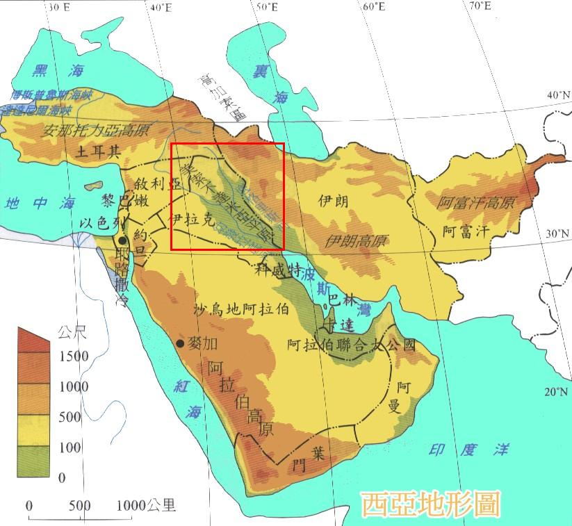

# Birth of Notion

All innovations stand on the shoulders of their forebears. 

Historians look much further back in time to discover the antecedents of trends or ideas and the true mothers of invention. We now understand that the Chinese developed movable type in 1041, long before Johannes Gutenberg; that the shipbuilding skills and navigational insights of Indians, Filipinos, Javanese, and Arabs were essential to Europe’s Age of Discovery; and that South America’s Quechua Indians vulcanized rubber two centuries prior to Charles Goodyear. Author Dick Teresi chronicles these and other developments in Lost Discoveries: The Ancient Roots of Modern Science – From the Babylonians to the Maya.

There’s little question that many centers of invention, adaption, cross-fertilization, and preservation have existed over the age. Although the examples that follow are hardly comprehensive, they are a few noteworthy stopovers on the road to innovations.

**Sumer 3500 BC-1775 BC** 

This Tigris-Euphrates valley culture invented a form of writing and the wheel around 3500 BC. Its people made cloth from wool and flax, built canals, observed the movement of planets, and worked out standard weights and measurements. Advances in math included quadratic equations and multiplication. Conquered by the Akkadians, the merged peoples formed the First Babylonian Empire, whose King Hammurabi \(1750 BC\) fashioned the law code that bears his name.

**Medieval Islam 750-1200 AD** 

Preserving and building on advances from Greece, Rome, and India- including philosophy, geology, engineering, hydraulics, and navigation –Muslim scholars were pioneers in astronomy and mathematics, including geometry, algebra, and trigonometry. They employed calendars and numerous timekeeping devices, including sundials, quadrants, astrolabes \(invented by the Greeks\), and compasses. They erected observatories at Baghdad, Damascus, and Maragha in Persia. Enhancements of Ptolemy’s model of planetary motion prefigured Copernicus.

